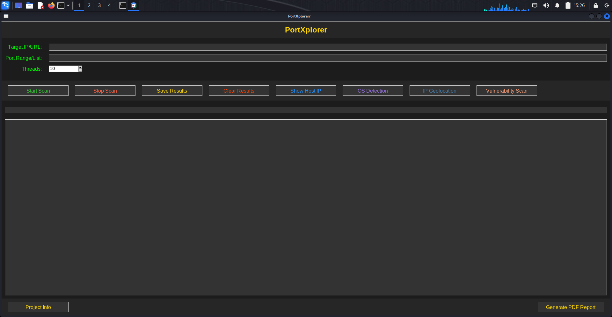

# PortXplorer

PortXplorer is a port scanning and vulnerability detection tool designed to help users identify open ports, detect operating systems, fetch geolocation data, and generate reports. The application features a user-friendly graphical interface built with the tkinter library.

## Features

- Port scanning to identify open and closed ports.
- Vulnerability detection using Nmap.
- Operating system detection based on TTL values.
- Geolocation information retrieval for IP addresses.
- PDF report generation for scan results.

## Screenshot


## Installation

To get started with PortXplorer, follow these steps:

1. Ensure Python is installed on your machine. You can download it from [python.org](https://www.python.org/downloads/).
2. Clone the repository or download the source code.
3. Navigate to the project directory in your terminal.
4. Install the required dependencies by running:

   ```
   pip install -r requirements.txt
   ```

## Usage

To run the application, execute the following command in your terminal:

```
python src/PortXplorer.py
```

## Dependencies

The project requires the following Python libraries:

- tkinter
- requests
- nmap
- reportlab

## Contributing

Contributions are welcome! If you have suggestions for improvements or new features, please open an issue or submit a pull request.

## License

This project is licensed under the MIT License. See the LICENSE file for more details.
